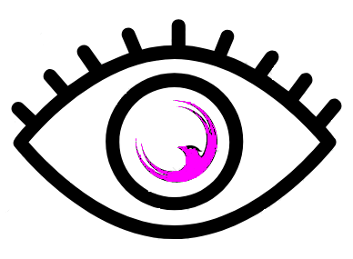

# F.E.M. : Falcon Eye Monitoring
Like a falcon, everything in sight! F.E.M. brings it all together: logfile, traces, metrics.

## Setup

### Java Application

You have to add the otel java agent as JVM parameter together with some configuration:

```
-javaagent:<path-to>/opentelemetry-javaagent.jar
-Dotel.exporter.otlp.endpoint=https://monitoring-host:4318 
-Dotel.exporter.otlp.certificate=<path-to>/server.crt 
-Dotel.resource.attributes=service.name=<name-of-the-service> 
-Dotel.metrics.exporter=otlp 
-Dotel.logs.exporter=otlp 
```

### F.E.M

The following diagram illustrates the container setup using Jaeger-Tracing using an Opensearch backend.


#### Interfaces

| external Interface | Port | Description |
|---|---|---|
| GrafanaUI | 23000 | Provides direct access to grafana. Do not use in production. Please use TraefikHttps instead. |
| JaegerQueryUI | 26686 | Provides direct access to jaeger ui. Do not use in production. |
| LokiHttp | 23100 | Provides api accessto loki. Do not use in production. |
| OtelAgentGrpc | 24318 | Secured endpoint to collect metrics, traces and logs from application. |
| PrometheusHttp | 29090 | Provides direct access to prometheus. Do not use in production. |
| TraefikDashboard | 28080 | Provides traefik dashboard. Do not use in production. |
| TraefikHttp | 20080 | Provides unencrypted access to traefik http interface. Do not use in production. |
| TraefikHttps | 20443 | Provides secured access to traefik http interface. |

#### Configuration / Preparation

- To create the sample ssl certificates for the otel collector you use the `certs` makefile target.
  **For production use your own certificates**
- To prepare the configuration files, use `config` target.

`make --file Makefile.fem clean config certs`

#### Start

`make --file Makefile.fem start`

#### Stop

`make --file Makefile.fem stop`


### DB Exporters

The following diagram illustrates the components used for database exporters. The exporter can be used together
with F.E.M. setup.

For now the following databases are supported:
- Postgresql
- MongoDB


#### Interfaces

| external Interface | Port | Description |
|---|---|---|
| Postgresql Port | 5432 |   |
| MongoDB Port | 27017 |   |
| PostgresqlHttp | 29216 | Provides direct access to the postgresql exporter. Do not use in production. |
| MongoDBHttp | 29187 | Provides direct access to the mongodb exporter. Do not use in production. |

`make --file Makefile.db-exporter clean exporter`

#### Start

`make --file Makefile.db-exporter start`

#### Stop

`make --file Makefile.db-exporter stop`

### Description

#### Traces

* Otel-Agent configured as Java-Agent for every application to monitor
* Traces are exported to Otel-Collector
* Otel-Collector exports traces to Jaeger-Collector
* Jaeger-Query is used to query data stored by Jaeger-Collector
* Data is stored in Opensearch backend
  * Opensearch database stores data in filesystem

#### Metrics

* Prometheus grabs metrics from Otel-Collector
  * Prometheus stores data in filesystem

##### Database metrics

* There are exporters for each database which are connected to the database using tls.
* The exports provide metrics endpoint

#### Logs

* Logfiles are exported to Otel-Collector by the Otel-Agent
* Data is pushed to Loki which stores data in filesystem

#### Java application metrics

* Metrics, traces and logs are exported to Otel-Collector

#### Grafana

* Metrics, traces and logs can be analyzed using Grafana
* Grafana is beeing provisioned with basic datasources:
** Prometheus for metrics
** Loki for logs
** jaeger for traces
* Grafana is beeing provisioned with basic dashboards
